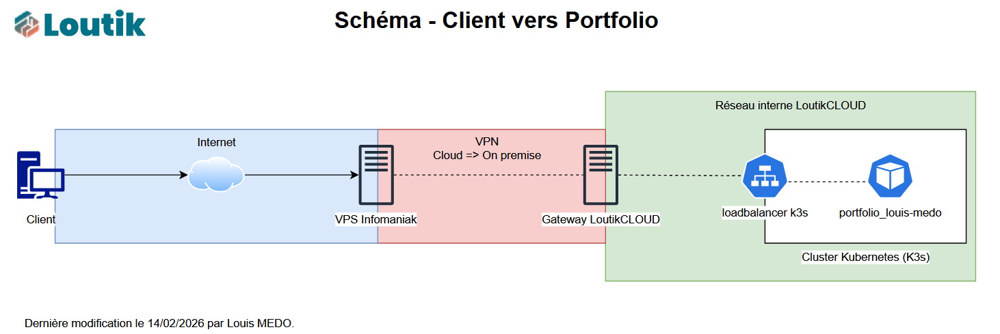

Durant mes études en BTS SIO (Services Informatiques aux Organisations) au lycée Paul-Louis Courier de Tours, il m'a été demandé de réaliser un portfolio. Ce dernier a pour but de présenter les différentes certifications et projets que j'ai réalisés en cours ou sur mon homelab.

L'objectif de ce portfolio est de créer une vitrine de mes compétences informatiques, facilement modifiable dans le temps, sans nécessiter de connexion manuelle à mon serveur ni de retouches directes du code HTML. J'ai donc pensé le site avec les contraintes suivantes :
- **Facilité d'édition :** Utilisation de fichiers JSON pour stocker les données liées à mes différents éléments.
- **Déploiement automatisé :** M'éviter de me connecter à mes serveurs à chaque modification.
- **Traçabilité :** Suivi des modifications (versioning) pour revenir en arrière en cas d'erreur dans le code.

---
## 📖 Expression des besoins

Il convient d'abord de définir les besoins de mon portfolio, qui doit respecter le référentiel du BTS SIO ainsi que mes objectifs cités ci-dessus.

### 1. Besoins fonctionnels :

- **Sections :** Le portfolio doit contenir une présentation de mon profil, du BTS SIO, de mes expériences, compétences, formations, projets, certifications, sources de veille, et des documents des épreuves E5 et E6.
- **Navigation :** La barre de navigation doit être positionnée à gauche et mettre en surbrillance la section active.
- **Mentions légales :** Pour respecter le RGPD, le site doit inclure les mentions légales obligatoires (responsable, hébergeur...).
- **Modification simple :** Mettre à jour le contenu facilement via des fichiers JSON sans éditer le code HTML.

### 2. Besoins techniques :

- **Automatisation :** Le site doit se mettre à jour seul, sans intervention manuelle sur le serveur.
- **Traçabilité des modifications :** Utilisation du versioning pour conserver un historique et annuler des changements en cas de bug.
- **Conteneurisation :** Le portfolio doit être packagé sous forme d'image Docker pour être hébergé sur mon infrastructure Kubernetes, garantissant ainsi sa scalabilité.

---
## 🔧 Technologies retenues

Plusieurs technologies se démarquent pour la réalisation de ce projet. Pour la partie web et infrastructure, j'ai sélectionné les solutions suivantes :

| Technologie | Justification |
| :--- | :--- |
| **PHP** *Affichage web* | PHP permet d'afficher dynamiquement les informations contenues dans les fichiers JSON. Il facilite également l'utilisation de snippets (réutilisation de composants de code). |
| **JSON** *Stockage des données* | Format léger et structuré (parents/enfants). Contrairement à une base de données, il ne nécessite pas d'infrastructure lourde ; un simple fichier permet à PHP de récupérer les informations. |
| **Tailwind CSS** *Mise en forme* | Ce framework utilitaire offre un gain de temps considérable en évitant l'écriture de fichiers CSS complexes. Il optimise également le code CSS final, rendant le site plus performant. |
| **Git** *Versioning* | Permet de conserver un historique complet de toutes les modifications effectuées sur le code source. |
| **GitHub Actions** *CI/CD* | Permet d'automatiser la création de l'image Docker du portfolio à chaque modification, facilitant ainsi son déploiement sur Kubernetes. |
| **Kubernetes (K3s)** *Orchestration* | Solution déjà opérationnelle sur mon infrastructure permettant d'héberger l'image Docker. Elle assure la haute disponibilité du site. |

---
## 🦺 Réalisation du site (Dev)

### 1. Le prototypage

Avant de débuter le développement, il est essentiel de définir la direction du projet. La première étape a consisté à réaliser une maquette sur Figma. Cela permet de visualiser le site et de s'assurer qu'il répond aux attentes. Une fois la maquette validée par les professeurs, le développement peut commencer sur des bases solides.

### 2. Brique par brique

Aujourd'hui, l'approche moderne consiste à développer des composants (ou briques) plutôt que de vastes monolithes. L'objectif est de déterminer quelles briques mettre en place et dans quel ordre.

J'ai commencé par définir l'arborescence du projet pour faciliter sa maintenance. J'ai ensuite configuré les outils nécessaires : Tailwind CSS et un conteneur local avec Apache2 pour prévisualiser le portfolio durant le développement.

Le développement a débuté par les composants réutilisables (header, navbar, footer). Ensuite, j'ai construit le corps des pages et intégré PHP pour la lecture dynamique des fichiers `.json`. Enfin, j'ai préparé les fondations du déploiement en rédigeant le fichier permettant de conteneuriser l'application.

### 3. Préproduction et sécurité

Avant toute mise en production, une revue de code s'impose. Bien que les technologies choisies présentent une surface d'attaque réduite, il est crucial de s'assurer de la sécurité de l'application. Par exemple, je vérifie rigoureusement que les requêtes PHP accèdent uniquement aux fichiers JSON prévus, évitant ainsi les vulnérabilités de type *Path Traversal*.

---
## ✨ Mise en place du site (Ops)

### Création du Dockerfile

Pour conteneuriser mon application, j'ai créé un `Dockerfile` basé sur une image officielle PHP incluant Apache.

```dockerfile
FROM php:8.2-apache

# Définition de l'argument (disponible uniquement pendant le build)
ARG APP_VERSION=v0.0.0

# Transformation en variable d'environnement (disponible pour PHP pendant l'exécution)
ENV APP_VERSION=${APP_VERSION}

COPY . /var/www/html/
COPY apache-config.conf /etc/apache2/sites-available/000-default.conf
RUN a2enmod rewrite
EXPOSE 80
```

### Pipeline CI/CD avec GitHub Actions

J'ai ensuite configuré un workflow GitHub Actions. À chaque "push" sur la branche principale, un script s'exécute automatiquement pour construire l'image Docker à partir du `Dockerfile`. Une fois construite, cette image est poussée et stockée de manière sécurisée dans le GitHub Container Registry (GHCR), prête à être déployée.

### Déploiement Kubernetes et Keel

Pour l'hébergement, j'ai rédigé les manifests Kubernetes (Deployment et Service) appliqués sur mon cluster K3s. Pour automatiser la mise à jour des pods, j'utilise **Keel**. Keel surveille le registre GitHub ; dès qu'une nouvelle version de mon image Docker y est publiée, il déclenche automatiquement le téléchargement de l'image et la mise à jour du pod sur mon cluster sans aucune intervention de ma part.

### Configuration du Reverse Proxy

Pour rendre mon site accessible depuis l'extérieur de manière sécurisée, le trafic passe d'abord par mon VPS cloud équipé d'un reverse proxy **NGINX** et sécurisé par le WAF **Crowdsec**. NGINX réceptionne la requête HTTP/HTTPS, puis la redirige au travers d'un tunnel VPN directement vers mon infrastructure on-premise hébergeant mon cluster K3s, qui sert la page web.



### Enregistrement DNS

Enfin, j'ai configuré la zone DNS de mon nom de domaine en créant un enregistrement de type "A" pointant vers l'adresse IP publique de mon VPS. Ainsi, lorsqu'un utilisateur tape l'URL de mon portfolio, la résolution DNS l'oriente correctement vers mon Reverse Proxy.

---
## 🎞️ Workflow final

Maintenant que l'infrastructure et l'automatisation sont en place, la mise à jour de mon portfolio est d'une grande simplicité. Une simple modification du code suivie d'un `git push` déclenche l'intégralité de la chaîne CI/CD jusqu'à la mise en production.

```
+----------+       +---------------+       +----------------+       +----------+       +-------------------+
| Développeur|       | GitHub Actions|       | GitHub Registry|       | Keel (K3s)|       | Pod Kubernetes    |
| (Git Push) | ----> | (Build Image) | ----> | (Push Image)   | ----> | (Watch)  | ----> | (Update & Deploy) |
+----------+       +---------------+       +----------------+       +----------+       +-------------------+
```

---
## 💡 Une démonstration pertinente de la méthodologie DevOps

Pour conclure, avec ce projet de Portfolio, je démontre qu'il est aujourd'hui indispensable de savoir conjuguer le développement (Dev) et la gestion d'infrastructure (Ops). Cette approche permet de construire des applications fiables et résilientes tout en automatisant les tâches répétitives pour gagner en efficacité.

---
## 🔗 Ressources

- **Dépôt GitHub du portfolio :** https://github.com/FireToak/portfolio-bts-sio
- **Dépôt GitHub du manifest kubernetes :** https://github.com/FireToak/k3s-deployment-portfolio
- **Lien vers le portfolio :** https://louis.loutik.fr/