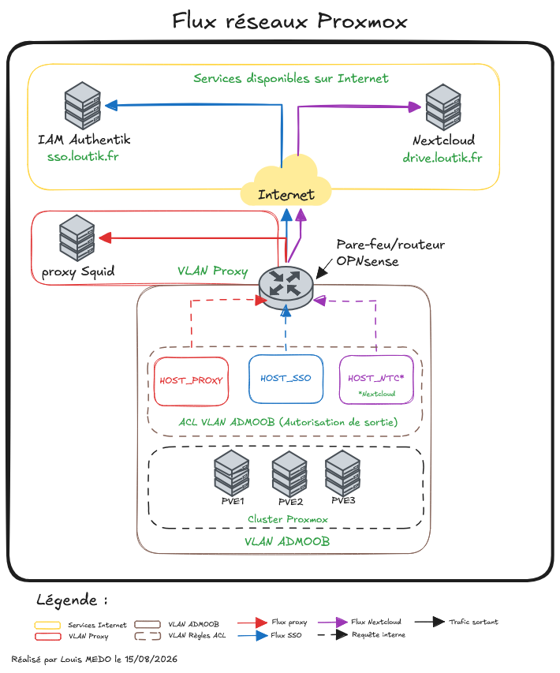
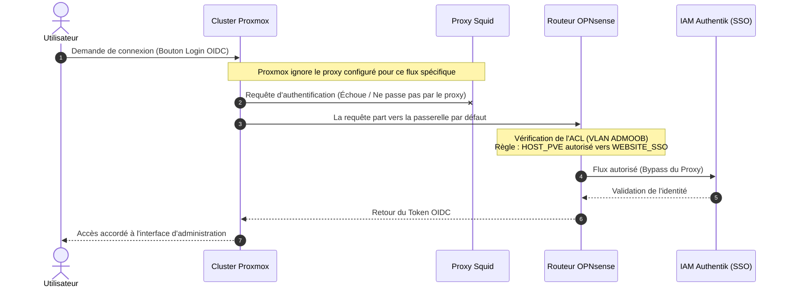

## A. Contexte

Le service Proxmox VE[^1] a été intégré au cœur de l'infrastructure LoutikCLOUD pour fournir une plateforme de virtualisation robuste. Ce cluster[^2] tourne sur un parc de récupération hétérogène et est hébergé dans un environnement réseau isolé, nécessitant une gestion rigoureuse des flux sortants et de l'authentification. 

## B. Architecture

L'infrastructure repose sur 3 hyperviseurs avec une séparation claire du stockage (Système / Données) pour optimiser les performances :
- **2x Nœuds HP ProDesk 400 G3** : Intel Core i5-6500, 32 Go RAM, SSD 256 Go (OS) et HDD 500 Go (Données).
- **1x Nœud Dell Inspiron 15 3225** : AMD Ryzen 5 5500U (12 cœurs), 16 Go RAM, SSD NVMe 256 Go (OS) et HDD 500 Go (Données).

*Flux réseaux Proxmox*

## C. Déploiement

Aucune configuration n'a été réalisée manuellement. L'ensemble a été provisionné en IaC[^3] à l'aide d'Ansible[^4] (via l'utilisateur de service `svc-ansible`). Une évolution est prévue pour remplacer l'inventaire statique actuel par un inventaire dynamique, ce qui unifiera la logique d'exécution des playbooks.

* **Étape 1 / Initialisation :** Exécution du playbook `pve-bootstrap-cluster.yml` pour initialiser le tout premier nœud et créer la base du cluster.
* **Étape 2 / Extension :** Exécution du playbook `pve-bootstrap-node.yml` pour configurer et faire rejoindre les deux autres machines au cluster existant.
* **Étape 3 / Sauvegardes :** Exécution du rôle `pve-rclone-backup` qui installe rclone et fuse3, puis crée un service systemd[^5] pour monter automatiquement un stockage Nextcloud via WebDAV[^6]. Ce point de montage est ensuite déclaré dans Proxmox pour stocker les sauvegardes.

## D. Difficultés

Lors de la mise en place, quelques ajustements ont été nécessaires :

* **Dépôts payants inaccessibles :** Par défaut, Proxmox cherche les dépôts "Enterprise", ce qui provoque des erreurs APT[^7] puisqu'il n'y a pas de licence. 
    * **Solution :** Le rôle Ansible `pve-bootstrap` supprime automatiquement le fichier `pve-enterprise.sources` et installe le dépôt communautaire `pve-no-subscription`.

* **Réseau isolé :** Les hyperviseurs n'ont pas un accès direct à Internet. 
    * **Solution :** Création d'un rôle `pve-proxy` qui configure le gestionnaire de paquets et l'API Proxmox pour forcer le passage par le proxy Squid de l'infrastructure (10.0.23.1:3128).
* **Proxy ignoré par le SSO OIDC :** Grosse subtilité réseau : Proxmox ne prend pas en compte la configuration proxy pour envoyer ses requêtes vers le fournisseur d'identité SSO OIDC[^8], ce qui faisait planter la connexion.
    * **Solution :** Ajout d'une ACL[^9] sur le routeur autorisant spécifiquement les nœuds (alias `HOST_PROXMOX`) à joindre le SSO. Pour anticiper d'éventuels changements d'IP, la destination a été renseignée via l'alias de domaine `WEBSITE_SSO` afin que le routeur gère la résolution DNS dynamiquement.

---

[^1]: **Proxmox VE** - Solution open source de virtualisation permettant de créer et gérer des machines virtuelles et des conteneurs.
[^2]: **Cluster** - Groupe de serveurs (nœuds) interconnectés qui fonctionnent ensemble comme un système unique pour assurer haute disponibilité et répartition de charge.
[^3]: **IaC (Infrastructure as Code)** - Méthode consistant à gérer et configurer des serveurs à l'aide de fichiers de code (scripts) plutôt que par des actions manuelles.
[^4]: **Ansible** - Outil d'automatisation informatique qui déploie des logiciels et configure des systèmes en lisant des fichiers d'instructions appelés "playbooks".
[^5]: **systemd** - Gestionnaire de système et de services standard sous Linux, utilisé ici pour démarrer le montage réseau en tâche de fond.
[^6]: **WebDAV** - Protocole web permettant de gérer des fichiers sur un serveur distant, souvent utilisé pour transformer un stockage cloud en disque réseau local.
[^7]: **APT** - Le gestionnaire de paquets utilisé par Debian (le système de base de Proxmox) pour télécharger, installer et mettre à jour les logiciels.
[^8]: **SSO OIDC (Single Sign-On / OpenID Connect)** - Système d'authentification unique permettant à un utilisateur de se connecter une seule fois pour accéder en toute sécurité à plusieurs applications.
[^9]: **ACL (Access Control List)** - Règle de sécurité sur un routeur ou pare-feu qui définit précisément qui a le droit de communiquer avec qui sur un réseau.