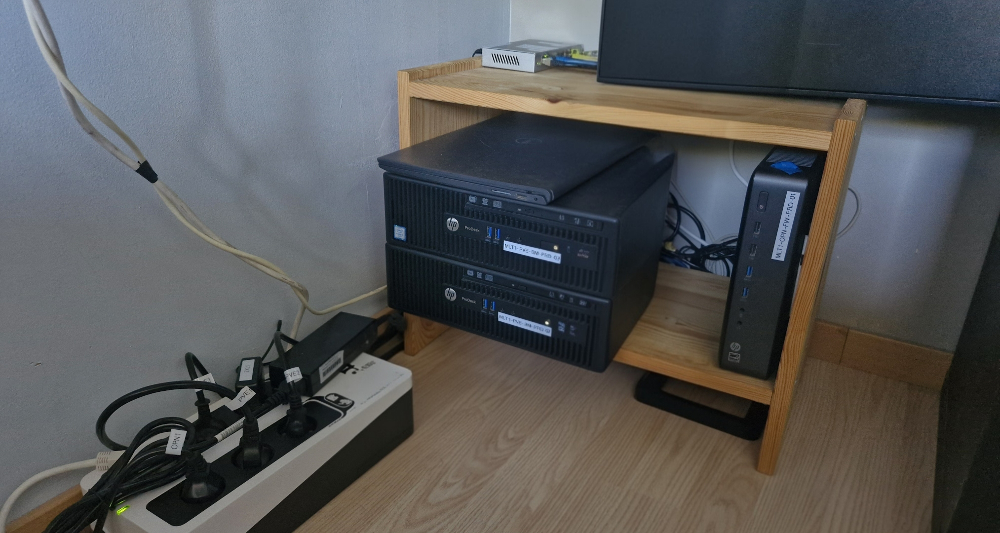
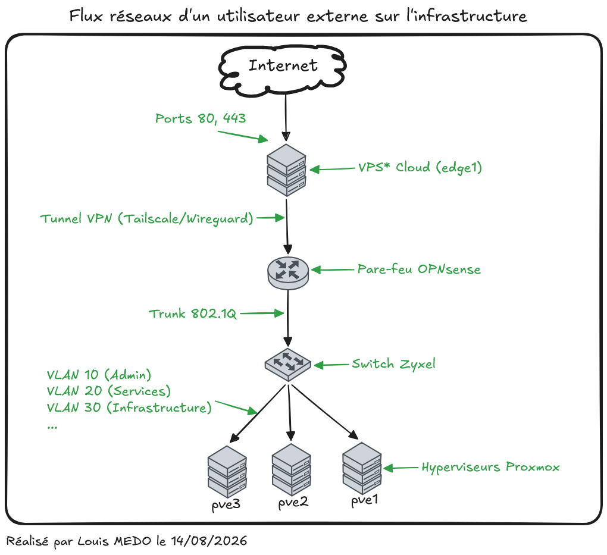

## Bienvenue chez loutikHOMELAB ! 🚀

Salut à toutes et à tous, et bienvenue à bord de l'aventure Loutik ! Dans cet article, on va faire un petit tour d'horizon du matériel, de l'architecture et des outils utilisés pour faire tourner ce homelab (qui est, comme tout bon homelab, en perpétuelle construction).

:::tip[En bref]
**loutikHOMELAB**, c'est :
- **De la haute disponibilité** : minimum deux nœuds par service critique.
- **Une architecture hybride** : un mix entre Cloud et *On-Premise*.
- **Du GitOps & IaC** : tout est géré via du code avec Ansible et ArgoCD.
- **Des bonnes pratiques** : plan de nommage strict, référentiels propres, principe du moindre privilège et segmentation réseau (ACLs).
:::

*Photographie du Homelab.*

## Pourquoi avoir monté ce homelab ?

Pour moi, je considère le homelab comme un jeu vidéo dans lequel je peux passer 11 heures par jour sans voir le temps filer. Sauf qu'au lieu de tuer des monstres sur Minecraft, je me casse la tête pour comprendre pourquoi mon pod Kubernetes redémarre en boucle, ou pourquoi mon application fraîchement déployée (et prétendument en statut *Healthy*) reste injoignable... Bref, un véritable jeu de réflexion et de résolution de problèmes qui me pousse, jour après jour, à améliorer mes services et mon architecture.

Au-delà de l'aspect purement ludique et de la passion, ce laboratoire grandeur nature me permet de documenter des projets concrets. C'est un excellent moyen de démontrer mes compétences en **administration système** et **DevSecOps**, ainsi que ma méthodologie de travail, avec de vrais cas d'usage.

---

## Concrètement, il y a quoi sous le capot ?

Le projet s'appuie sur les standards de l'industrie Cloud et DevSecOps. J'organise par exemple mon travail avec une approche **Agile** pour garder le cap (visualisation de l'avancement, priorisation des tâches, historique des actions).

:::tip[Les dépôts GIT du homelab]
[Github Loutik Repositories](https://github.com/orgs/loutik/repositories)
:::

L'infrastructure (*LoutikCLOUD* pour les intimes) est découpée en plusieurs couches logiques. Voici comment tout cela est structuré :

### 1. La documentation

Parce qu'une infra sans documentation est une infra qu'on reconstruit tous les 2 mois de zéro, j'y accorde une importance capitale :

- **Standard Diataxis** : J'utilise la méthodologie [Diataxis](https://diataxis.fr/) pour structurer l'information de manière claire et orientée utilisateur.
- **ADR (Architecture Decision Records)** : Chaque choix technologique majeur est documenté et justifié.
- **Segmentation logique** : La documentation est divisée en catégories (`architecture` pour les choix techniques, `infrastructure core` pour les bases, `edge` pour le routage type LoadBalancer/Reverse Proxy, `securite` pour le WAF/IDS, et `services` pour les applications hébergées comme Authentik ou BentoPDF).
- **Documentation de l'infrastructure :** [Documentation infrastructure - LoutikCLOUD](https://docs-infra.loutik.fr)

### 2. L'Architecture réseau

L'infrastructure n'est pas exposée directement. Elle repose sur un réseau segmenté et sécurisé via des ACLs.

*Flux réseaux des utilisateurs externes.*

**Légende des équipements :**

* **edge1 :** VPS Cloud (hébergé chez Infomaniak). C'est le point d'entrée public qui fait office de front pour l'infrastructure.
* **Tunnel VPN :** La liaison sécurisée qui permet au VPS de communiquer avec le réseau local.
* **Pare-feu :** Sécurité du réseau local, route les paquets et filtre les menaces via l'IPS.
* **Switch :** Le commutateur qui s'occupe de distribuer le trafic physiquement et de gérer l'isolation réseau via les VLANs.
* **pve1, pve2, pve3 :** Les alias de nos trois nœuds physiques Proxmox, connectés au switch, qui portent toute la virtualisation du lab.

### 3. Matériel, virtualisation et automatisation

Pour héberger tout ça, j'utilise une flotte de machines gérées comme du "bétail" (concept *Cattle vs Pets*) grâce à Proxmox et Ansible.

import { Tabs, TabItem } from '@astrojs/starlight/components';

<Tabs>
  <TabItem label="Réseau" icon="router">
    - **Pare-feu (OPNsense)** : Un valeureux *HP T730 thin client*. Il tourne avec un processeur AMD GX-420CA (4 cœurs / 4 threads), 8 Go de RAM, et une carte PCIe ajoutée offrant deux ports Ethernet 1Gb/s pour faire le pont entre l'extérieur et l'intérieur.
    - **Commutateur (Switch)** : Un *Zyxel GS1200-8* avec 8 ports 1Gb/s. C'est lui qui distribue le trafic et gère l'isolation (VLANs et trunk). L'agrégation de lien est dispo, mais je ne l'utilise pas encore sur ce lab.
  </TabItem>
  
  <TabItem label="Hyperviseurs (Proxmox)" icon="laptop">
    Pour la puissance de calcul, le cluster s'appuie sur trois machines physiques distinctes :
    - **Deux nœuds HP Prodesk 400 G3** : Équipés d'un processeur Intel i5-6500 (4 cœurs), 32 Go de RAM, un SSD NVMe de 256 Go pour l'OS, et un HDD de 500 Go pour stocker les VMs.
    - **Un nœud Dell Inspiron 15 3225** : Un laptop avec son Ryzen 5 5500U (12 cœurs !), 16 Go de RAM, un SSD NVMe de 256 Go, et un HDD de 500 Go.
  </TabItem>
</Tabs>

### 4. Conteneurisation

Le cœur applicatif de *LoutikCLOUD* repose sur Kubernetes, et plus particulièrement sur **K3s**, une distribution légère et parfaitement taillée pour le homelab. 

Pour garantir la résilience de l'infrastructure, le cluster est découpé stratégiquement :
- **3 nœuds Control Plane** : Ils gèrent le cerveau du cluster et assurent le quorum (si l'un tombe, les deux autres prennent le relai sans sourciller).
- **2 nœuds Worker** : Complètement séparés des plans de contrôle, ce sont les petits ouvriers qui font tourner les applications au quotidien.

Côté déploiement, on oublie les interventions manuelles et les commandes `kubectl apply` tapées à la hâte. L'ensemble est géré selon les principes du **GitOps** grâce à **ArgoCD**. Le principe est super reposant : mes dépôts Git sont la source unique de vérité. Dès que je pousse une modification dans un manifeste, ArgoCD s'en aperçoit et synchronise automatiquement le cluster pour qu'il reflète exactement le code. C'est propre, auditable, et ça évite pas mal de sueurs froides !

:::tip[Haute Disponibilité (HA) des Control Planes]
Pour pousser la résilience jusqu'au bout, j'ai mis en place une **VIP (Virtual IP)**. Le principe est simple : si le nœud maître principal tombe, cette adresse IP bascule automatiquement sur un autre nœud sain. Tout le monde communique via cette adresse (`10.0.12.6`) ou via son entrée DNS (`vip.prd.k3s.infra.loutik.fr`), ce qui rend la panne d'un hôte totalement transparente.
:::

---

Et voilà pour ce grand tour du propriétaire ! Le projet évolue constamment au fil de mes apprentissages et des nouvelles technos que j'ai envie d'expérimenter. N'hésitez pas à parcourir le reste de la documentation pour voir tout ça plus en détail.