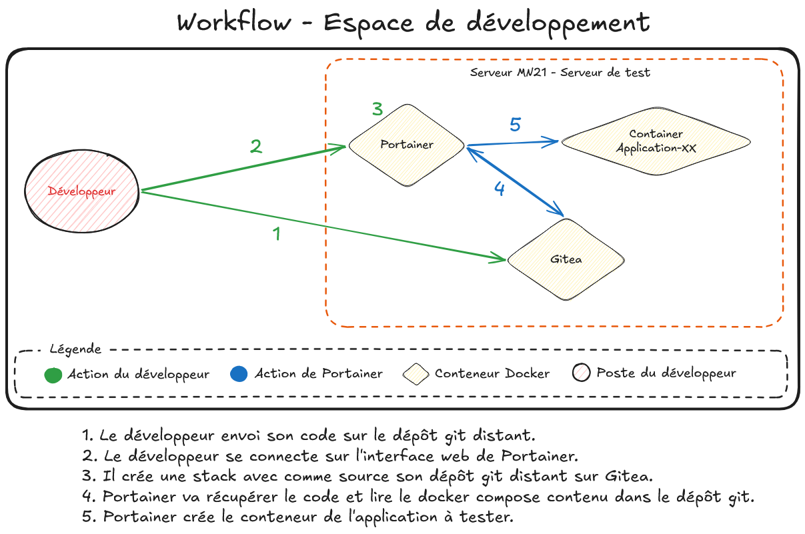

import { Steps } from '@astrojs/starlight/components';

## 🎯 Objectif de la mission

Le besoin initial consistait à fournir aux développeurs un environnement de test autonome, reproductible et strictement isolé du réseau de production. Historiquement confrontés aux conflits de dépendances locaux, l'objectif était de normaliser leurs déploiements grâce à la conteneurisation. Cette intervention vise à implémenter une infrastructure Docker sécurisée au sein d'une DMZ, administrable via une interface web restreinte (approche Zero-Shell) et propulsée par un flux de travail GitOps continu, tout en fournissant un support de formation adapté.

## 🛠️ Déroulement des opérations

Pour mener à bien cette mission, l'intervention a été découpée en plusieurs phases clés :

<Steps>
1. **Préparation et sécurisation du socle d'hébergement :** 
   Installation du moteur Docker sur le serveur de pré-production. Une attention critique a été portée au durcissement (hardening) du démon en désactivant l'acquisition de nouveaux privilèges pour les processus conteneurisés, en configurant la rotation automatique des journaux d'événements et en activant l'isolation des espaces de noms (mapping de l'utilisateur root vers un compte restreint).

2. **Déploiement des services d'orchestration et de versionning :** 
   Instanciation des solutions Gitea (forge logicielle) et Portainer (interface d'administration Docker) via des fichiers de configuration orientés Infrastructure as Code. Les mots de passe et données sensibles des bases de données associées n'ont pas été inscrits en clair, mais stockés dans un coffre-fort d'équipe puis injectés dynamiquement sous forme de variables d'environnement.

3. **Configuration du contrôle d'accès et du flux GitOps :** 
   Mise en œuvre du principe de moindre privilège via Portainer. Une équipe logique a été créée pour restreindre les développeurs à un environnement de déploiement spécifique, sans aucun accès d'administration global ou SSH au serveur physique. Le flux de travail a été automatisé pour que les conteneurs se déploient directement en lisant les configurations stockées sur les dépôts Gitea.

4. **Validation de l'isolation réseau (DMZ) et tests d'intégration :** 
   Vérification de l'étanchéité du réseau via l'application d'une liste de contrôle d'accès (ACL) stricte sur l'équipement de routage, bloquant tout trafic initié depuis le sous-réseau de test vers la production. Exécution d'un plan de recette validant le rejet des paquets ICMP non autorisés et l'accessibilité des services web déployés.
</Steps>

## ✅ Résultats

:::tip[Statut de l'intervention]
**Succès :** L'espace de développement est pleinement opérationnel et répond aux exigences de sécurité.
- Les requêtes réseau depuis la DMZ vers la production sont correctement bloquées par les règles de filtrage.
- Les développeurs déploient leurs architectures en autonomie via l'interface web de Portainer, sans exposition directe du système d'exploitation hôte.
- Le flux de déploiement automatisé (GitOps) lit avec succès les dépôts Gitea pour instancier les services.
- Le module de formation pédagogique expliquant l'architecture en micro-services est finalisé et prêt à être dispensé.
:::

### 🔗 Annexes

*Schéma réseau - Espace de développement*

*Schéma - Workflow espace de développement*

Le workflow se déroule en cinq étapes, entièrement au sein du serveur MN21 isolé en DMZ :

1. **Le développeur pousse son code** depuis son poste vers le dépôt Git distant hébergé sur **Gitea** (conteneur Docker sur MN21). Gitea joue le rôle de source de vérité pour le code source et les fichiers de configuration d'infrastructure (`docker-compose.yml`).

2. **Le développeur se connecte à Portainer** via son navigateur web sur l'interface HTTPS (port 9443). Son accès est restreint à l'environnement de développement qui lui a été délégué — il ne peut pas accéder aux paramètres globaux du serveur.

3. **Le développeur crée une Stack dans Portainer** en pointant vers son dépôt Gitea. Portainer utilise la méthode "Repository" : il lit directement le `docker-compose.yml` stocké dans le dépôt Git, ce qui garantit que le déploiement est toujours synchronisé avec le code versionné.

4. **Portainer récupère la configuration** en allant lire le fichier `docker-compose.yml` depuis le dépôt Gitea. Cette étape constitue le cœur de l'approche **GitOps** : l'infrastructure est décrite sous forme de code, versionnable et auditable.

5. **Portainer instancie les conteneurs** de l'application à tester (service web, base de données, etc.) sur le moteur Docker de MN21. Le conteneur applicatif est alors accessible depuis le sous-réseau développeurs.

## 🎓 Compétences BTS SIO (Épreuve E4) mobilisées

Cette intervention technique a permis de mettre en pratique et de valider les compétences suivantes :

| Compétence globale | Sous-compétence | Actions menées lors de la mission |
| :--- | :--- | :--- |
| **1.1 Gérer le patrimoine informatique** | **Mettre en place les habilitations** | Configuration du contrôle d'accès (RBAC) sur Portainer pour déléguer la gestion d'un environnement restreint aux développeurs. |
| **1.1 Gérer le patrimoine informatique** | **Exploiter des référentiels, normes et standards** | Durcissement sécuritaire du moteur Docker en appliquant l'isolation des privilèges (User Namespace Remapping). |
| **1.4 Travailler en mode projet** | **Analyser les objectifs** | Rédaction d'un document de décision d'architecture (ADR) justifiant le choix de l'interface graphique face aux contraintes Zero-Shell. |
| **1.5 Mettre à disposition un service** | **Déployer un service** | Instanciation des plateformes d'infrastructure (Gitea, base de données PostgreSQL, Portainer) via des manifestes d'orchestration. |
| **1.5 Mettre à disposition un service** | **Accompagner les utilisateurs** | Création d'un support pédagogique expliquant les enjeux de la conteneurisation pour faciliter l'adoption de l'outil par les équipes. |