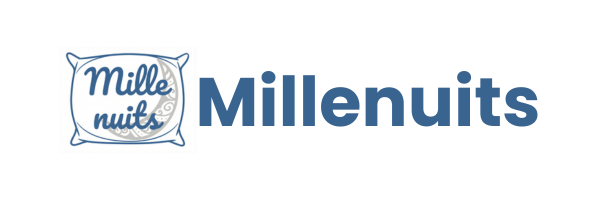

## Contexte Millenuits

---

:::note[Informations rapides]
* **Nom de l'entité :** Millenuits
* **Lieu :** Baugé-en-Anjou (Siège historique) & Joué-Lès-Tours (Site logistique)
* **Taille de l'infrastructure :** PME industrielle de 167 employés répartis sur deux sites distants.
* **Mon rôle :** Administrateur Système et Réseau, profil DevSecOps
* **Périmètre d'action :** Audit de l'existant, refonte de l'architecture réseau (segmentation), sécurisation du système d'information et modernisation de la gestion du parc.
:::

## 📋 Présentation de la situation

Millenuits est une PME française florissante, leader sur le marché de la production de couettes et d'oreillers avec plus de 35 000 pièces produites par jour. L'entreprise est divisée en deux entités géographiques : un site historique à Baugé-en-Anjou qui regroupe l'administration, la direction et la production, et un site logistique distant à Joué-Lès-Tours pour la gestion des stocks et expéditions. Le système d'information soutient l'activité de 167 collaborateurs et repose sur une petite équipe informatique interne.

Le défi principal de ce contexte réside dans la vétusté technique et organisationnelle de l'infrastructure de départ. Le réseau est un grand réseau plat (sans segmentation), la gestion de parc se fait via un simple tableur, et la sécurité des postes de travail repose sur des antivirus isolés. L'objectif est d'apporter une vision d'ingénierie moderne et DevSecOps : cartographier, segmenter, sécuriser les accès (notamment pour les postes en libre-service de la production) et fiabiliser la liaison inter-sites, tout en garantissant une haute disponibilité pour le PGI (Open ERP) qui est le cœur de l'entreprise.

## 🎯 Compétences travaillées (Épreuve E4)

Dans le cadre de ce contexte, plusieurs compétences et sous-compétences du référentiel officiel du BTS SIO ont été mobilisées et justifiées :

| Compétence globale | Sous-compétence mobilisée | Justification et trace concrète |
| --- | --- | --- |
| **1.1 Gérer le patrimoine informatique** | Recenser et identifier les ressources numériques | Audit complet de l'infrastructure pour remplacer la gestion obsolète par tableur et cartographier les équipements réseau répartis sur les deux sites géographiques. |
| **1.1 Gérer le patrimoine informatique** | Mettre en place et vérifier les niveaux d’habilitation | Restructuration et durcissement des droits via l'Active Directory pour sécuriser de manière granulaire l'accès aux postes de production en libre-service et au PGI. |
| **1.4 Travailler en mode projet** | Analyser les objectifs et les modalités | Étude des besoins de refonte de l'architecture (fin du réseau plat) et définition des étapes pour intégrer des pratiques d'administration modernes sans interrompre la chaîne de production. |

## 🏗️ Environnement technique

L'écosystème technologique de départ repose sur une architecture Windows Server traditionnelle, centralisée dans une salle climatisée sur le site de Baugé-en-Anjou. L'enjeu est de transformer cette base classique en un environnement robuste, segmenté et prêt à accueillir des processus d'administration automatisés.

### Topologie réseau

À l'origine, l'entreprise fonctionne sur un réseau local unique et non segmenté (adressage en `192.168.110.0/24`), mélangeant tous les services (RH, compta, vente, serveurs). L'accès à Internet est fourni via une box ADSL classique avec une adresse IP publique fixe (`45.17.25.3`). Le site logistique distant y est rattaché au moyen d'une liaison privée dédiée. Seul le réseau industriel des automates est physiquement isolé.

### Services existants

* **Serveur MN01 (Windows Server) :** Cœur de l'infrastructure réseau. Il héberge les rôles critiques AD (Active Directory), DNS, DHCP et centralise le partage de fichiers communs.
* **Serveur MN02 :** Serveur dédié à la messagerie d'entreprise (format prenom.nom@millenuits.com).
* **Serveur MN03 (Open ERP) :** Serveur hébergeant le Progiciel de Gestion Intégré, vital pour la comptabilité, les achats, les ventes et la gestion en temps réel des stocks entre les deux sites.

## 📄 Documentation

Dans les sous-sections de ce contexte, vous retrouverez des articles thématiques liés à ce projet (Virtualisation, Conteneurisation, Réseau, etc.).

:::note[Précision importante]
La documentation présente sur ce portfolio a pour unique but de présenter l'architecture et la logique derrière mes choix techniques. Vous n'y retrouverez pas de documentation d'exploitation pure.

Pour consulter les procédures techniques détaillées et les documentations d'installation de ce projet, je vous invite à consulter ce lien :

👉 **[Documentation technique - Millenuits](https://ap-bts-sio-louis.github.io/millenuits/)**
:::